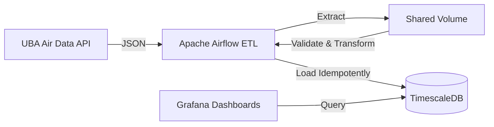

# Urban Air Intelligence — Germany

## Project Overview
Urban Air Intelligence Germany is a data pipeline that continuously collects, validates, transforms, and stores air quality measurements from the German Umweltbundesamt (UBA). The data is stored in a TimescaleDB instance and visualized using Grafana. The pipeline is orchestrated using Apache Airflow.

## 🎥 Project Demo

Watch the project demo: https://youtu.be/7FCTeecfUaU

## Architecture Diagram


## UBA Data Source
The data is retrieved from the UBA API endpoints:
* `/components/json`: Pollutant definitions (PM10, PM2.5, NO2, O3, SO2, CO)
* `/stations/json`: Monitoring stations metadata (location, network, type)
* `/scopes/json`: Measurement scopes (e.g., One hour average)
* `/measures/json`: Hourly measurements

## Airflow DAG
The DAG `uba_air_quality_ingestion` runs hourly.
Tasks:
1. `extract`: Fetches data for the logical execution date and stores raw JSON.
2. `validate`: Validates the raw JSON payload structure.
3. `transform`: Normalizes the nested dictionaries and validates output against Pydantic models.
4. `load`: Inserts records idempotently into TimescaleDB.

## TimescaleDB Schema
* `stations`: Contains station metadata (unique on `station_id`). Updates on conflict.
* `measurements`: Hypertable partitioned by `timestamp`. Unique constraint on `(station_id, component_id, timestamp)` for idempotency.

The UBA API uses different averaging scopes by pollutant. The ingestion parser
keeps PM10 and PM2.5 rolling daily means (`1TMWGL`), CO and O3 eight-hour means
(`8SMW`), and NO2 and SO2 one-hour means (`1SMW`). PM2.5 is normalized to the
canonical `PM2.5` component label even though the API code is `PM2`.

## Grafana Dashboards

Grafana provisions two dark-theme dashboards from `grafana/dashboards/`:

* **Urban Air Intelligence Germany** — overview KPIs, six pollutant trends, station map, data freshness, and station coverage. Pollutant lines use distinct colors and labeled concentration units; CO is shown per reporting station because its current coverage is only two stations.
* **Pollutant Explorer · Germany** — choose one pollutant and compare the ten highest-mean station trends, its average daily cycle by hour, and the highest city means. City/station and time filters apply across the dashboard.

The overview and explorer default to the last seven days. UBA reports are intermittent, so charts show reported samples without inventing measurements between them. Most pollutants are reported in µg/m³; CO is reported in mg/m³. Do not compare their raw magnitudes across different pollutants.

The dashboard uses a dark palette, clear legends, rounded bar charts, and per-pollutant colors for projection or screen recording. Grafana connects to TimescaleDB through the Compose network using `timescaledb:5432`. The datasource database name is configured under `jsonData.database` in `grafana/provisioning/datasources/datasource.yml`.

Grafana is available at `http://localhost:3000` (`admin` / `admin_password`). After changing provisioned dashboard files, restart Grafana to reload them:

```bash
docker compose up -d --force-recreate grafana
```

## Docker Setup
Requirements: Docker Compose (v2)

To start the pipeline:
```bash
docker compose down -v
docker compose up -d --build
```
Services:
* `uba_timescaledb`: TimescaleDB / Postgres (Port 5432)
* `uba_airflow_metadata`: Postgres for Airflow metadata
* `uba_airflow_webserver`: Airflow UI (Port 8080)
* `uba_airflow_scheduler`: Airflow Scheduler
* `uba_grafana`: Grafana UI (Port 3000)

## Example SQL Queries
Retrieve the maximum NO2 value for Berlin in the last 24 hours:
```sql
SELECT MAX(value) as max_no2
FROM measurements
JOIN stations USING (station_id)
WHERE component = 'NO2'
  AND city = 'Berlin'
  AND timestamp >= NOW() - INTERVAL '24 hours';
```

## Backfill Example
To backfill data for a specific historical date via Airflow CLI:
```bash
docker exec uba_airflow_scheduler airflow dags backfill uba_air_quality_ingestion \
  --start-date 2026-09-01 \
  --end-date 2026-09-05
```
Alternatively, clear historical task instances from the Airflow UI to trigger the catchup/backfill.

## Data Limitations
* The UBA API updates hourly but there may be delays in reporting from specific monitoring networks.
* Incomplete payloads or missing observation values in the API response are dropped during validation.
* Data points are ingested "as is". Missing continuous data points are not artificially interpolated.
